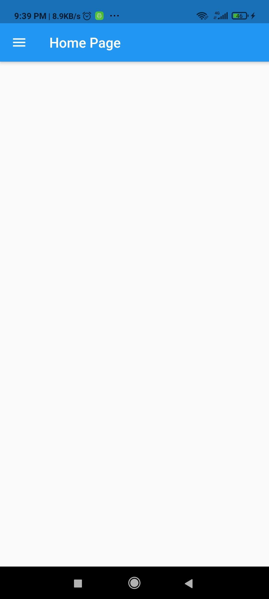
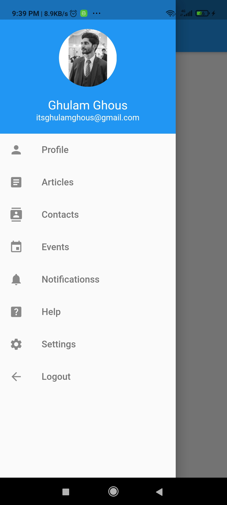

# Navigation Drawer
This app is a part of small tasks to learn Flutter. In this Row Widget, Icon Widget, TileView Widget, Image Widget, Column Widget, Center Widget and Padding Widget are covered. 

## Screens
    
